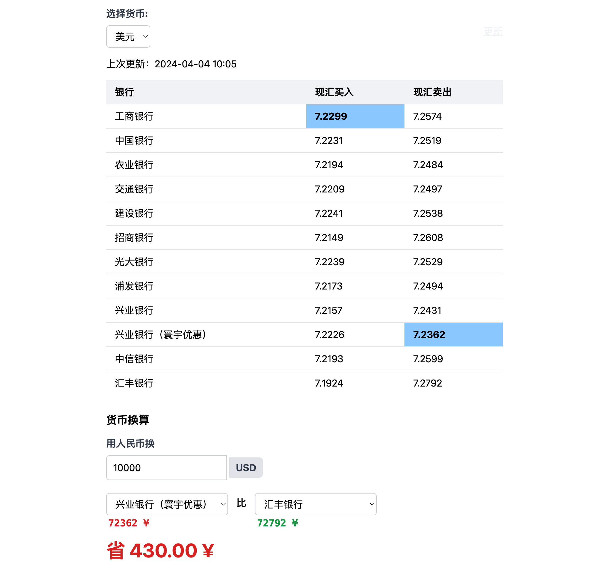

# Foreign Exchange Rate Comparison App

This is a web application that compares foreign exchange rates from different banks in China. Users can select a currency and view the buying and selling rates for that currency at various banks. The app also provides a currency conversion feature that calculates the potential savings by comparing the best and worst selling rates.

## Features

- Select from a list of currencies (USD, HKD, JPY, GBP, EUR, AUD, CAD, SGD)
- Display the buying and selling rates for the selected currency at different banks
- Highlight the best buying rate and the best selling rate
- Convert an amount in RMB to the selected currency using the best and worst selling rates
- Calculate the potential savings by comparing the best and worst selling rates
- Update the exchange rates by clicking the "Update" button

## Requirements

- Python 3.7+
- Flask
- requests

## Installation

1. Clone the repository:

```bash
git clone https://github.com/...
```

2. Change to the project directory:

```bash
cd forex-comparison-app
```

3. Install the required dependencies:

```bash
pip install -r requirements.txt
```

4. Create and write your APP CODE into `keys.py` file:

Buy the APP CODE from [Aliyun](https://market.aliyun.com/products/57000002/cmapi010841.html?spm=5176.product-detail.sidebar.1.5b2d2fe5ZPfKOv&scm=20140722.C_cmapi010841.P_146.MO_732-ST_4769-V_1-ID_cmapi010841-OR_rec#sku=yuncode484100008)
    
```python
ALI_APP_CODE = "your_app_code"
```

## Usage

1. Start the server:

```bash
uvicorn forex_server:app --host 0.0.0.0 --port 80
```

2. Open a web browser and navigate to `http://localhost` (or the appropriate IP address if running on a remote server).

3. Select a currency from the dropdown menu to view the exchange rates.

4. Enter an amount in RMB and select banks from the dropdown menus to compare the conversion rates and potential savings.

5. Click the "Update" button to fetch the latest exchange rates.


## Contributing

Feel free to submit pull requests or open issues if you find any bugs or have suggestions for improvements.

## License

This project is open-source and available under the [MIT License](https://opensource.org/licenses/MIT).